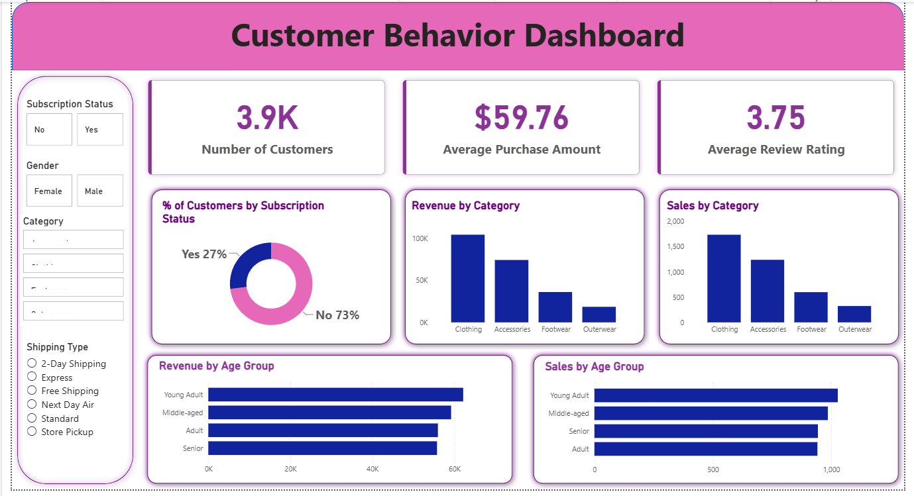

# Customer Shopping Behavior Analysis

## Overview
Analysis of customer shopping behavior to understand what drives purchase decisions and repeat buying — covering demographics, discounts, subscriptions, and product categories. The goal is to identify patterns that can inform marketing and customer retention strategy.

## Dataset
- **Size:** 3,900 customer records
- **Fields:** Customer ID, Age, Gender, Item Purchased, Category, Purchase Amount, Location, Season, Review Rating, Subscription Status, Shipping Type, Discount Applied, Promo Code Used, Previous Purchases, Payment Method, Frequency of Purchases

## Tools
| Stage | Tool |
|---|---|
| Data Cleaning & EDA | Python (Pandas, Matplotlib/Seaborn) |
| Data Analysis | SQL |
| Visualization | Power BI |

## Workflow
1. **Data Preparation (Python)** — cleaned the raw dataset and handled missing values
2. **Data Analysis (SQL)** — wrote queries to answer business questions such as revenue by gender, customer segmentation (New/Returning/Loyal), top products by category, and the impact of discounts and subscriptions on spending
3. **Visualization (Power BI)** — built an interactive dashboard to explore the findings

## Dashboard


## Repository Structure
```
├── python/                          # Data cleaning & EDA scripts
├── sql/                              # SQL analysis queries
│   └── customer_behavior_sql_queries.sql
├── powerbi/                          # Power BI dashboard file
│   └── customer_behavior_dashboard.pbix
├── data/                             # Dataset
│   └── customer_shopping_behavior.csv
├── images/                           # Dashboard screenshot
│   └── Dashboard.png
└── README.md
```

## How to Run
1. Clone this repository
2. Install Python dependencies: `pip install pandas matplotlib seaborn`
3. Run the cleaning/EDA script in `python/` to prepare the dataset
4. Run the queries in `sql/customer_behavior_sql_queries.sql` against your database
5. Open `powerbi/customer_behavior_dashboard.pbix` in Power BI Desktop to view the dashboard


